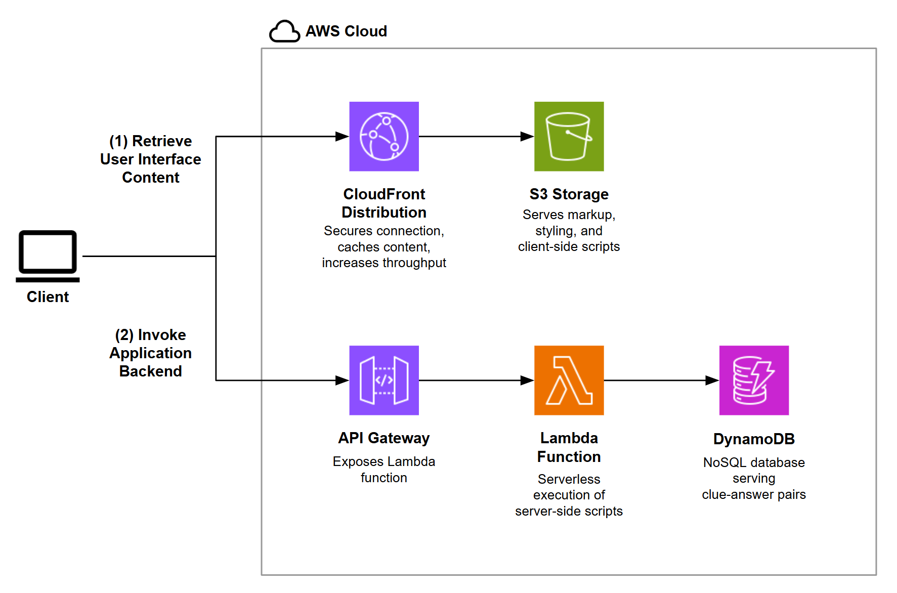

# Hangman Trivia
An engaging trivia game, hosted at https://yahianassab.com/hangmantrivia.

## Target Audience
Before designing trivia questions, one must decide on the target audience. NBC's "Jeopardy!" follows this philosophy and executes it very well. For example, teen and college tournaments in the early 2020s are not only "easier", but also cover topics like video games and popular software that an older audience would find challenging.

The questions in this game are designed to be recognizable by worldwide English speakers (not only in English-speaking countries) with a target birth date range of the mid-1980s to the mid-2000s. Note that this does naturally bias the popular culture references to American media, since the U.S. is a large cultural exporter.

Cultural references in music, television, and sporting events are predominantly from after the year 2000, even in the "Hard" difficulty pool, in which greater challenge was primarily induced by increasing the specificity rather than expanding the time range. Literature and visual arts have expanded time ranges (in some cases hundreds of years) since those areas are more likely to be studied in school. Questions on film appear in a mixture of these two time ranges.

Finally, an international audience is the motivation behind giving association football greater weight than other sports, given that it is popular in most of the world's countries.

## User Experience (UX) Design

### Overall UX design philosophy
The goal of the game is to be enjoyable to play. It is tested extensively in search of frustrations, which are systematically removed in each iteration. Importantly, what is a frustration for one person is often not so for another, so observing how different people interact with the game is crucial. Test subjects may not always be available, but creating personas for users from a limited number of real-world testing experiences can help uncover oversights as the project continues to develop.

### Difficulty design
"Normal" diffuculty clues are designed such that a generally well-educated person in the English-speaking world should be able to recognize 70-80% of the answers in every category, if not recall them.

"Hard" difficulty clues are designed such that someone who would be considered particularly knowledgeable in a given category would be able to not only recognize, but recall 90-100% of the answers, although the answer would be unlikely to be known by an average person. Clues in this category are approximately the same level of difficulty as may be found on NBC's "Jeopardy!".

### Rules for Clue Writing

1. **Single, unambiguous answer**: For example, there are no clues of the form "[Country/person/company/etc.] known for its [quality]" if there would be any room for varying interpretations. Usually, an additional qualifier is added, such as a date, to narrow it down to only one possibility.

2. **Time-invariant clues**: The player should not be required to know the year the clue was written (for a long time into the future). For example, there are no clues of the form "[Sport] team that has won the most championship titles", which regularly changes over time. Instead, the large majority of clues (sport-related or otherwise) will never have their answers change. A small minority of clues may change at some point, although it is unlikely to happen the next 10-15 years: e.g., "Trades as [ticker symbol] on the [major stock exchange]" is generally safe for a large established company that has not changed its ticker symbol for decades.

3. **No answers with multiple phrasings or spellings**: E.g., answers like "MARIANA TRENCH" were avoided due to the common (mis-)spelling of "MARIANAS TRENCH". British spelling is used in the clues, but words that differ in American and British spelling do not appear in answers.

4. **Constraints on answer length**: The full answer is between 4 and 20 letters long for stylistic consistency. There are at least 3 unique characters to allow room for guessing if the player does not know the answer. Each individual word in the answer is at most 12 characters so as to fit on mobile devices.

5. **Letter-only guessing**: Only letters can be guessed while numbers and special symbols are given to the user for free. This adds an element of fairness and predictability for the player persona that would approach unfamiliar clues from a statistical angle; i.e., it is useful for them to know that the total space of possibilities is exactly 26. It also simplifies the mobile keyboard layout (see below).

6. **Ease of guessing by a layman**: E.g., numbers large enough to normally warrant scientific notation are written in expanded form so that a layman can at least understand the clue before they begin guessing letters.

7. **Individually verified**: Clues and their associated answers are carefully fact-checked. Needless to acknowledge, non-factual answers to trivia questions result in a poor experience.

Note: The "Drunk" difficulty does not follow some of these rules (namely those regarding ambiguity, length, and phrasing) in order to allow for more creative freedom in invoking out-of-the-box thinking.

### Affordance
In design psychology, "affordance" refers to possible actions that an actor readily perceives. Here, the letter placeholders appearing on screen suggest that the user should begin typing on their keyboard, without any specific instructions to do so.

It was revealed in testing that placing a virtual keyboard on-screen makes users think that the only way to guess letters is to use the virtual keyboard. A virtual keyboard is shown only on mobile (in place of the built-in keyboard) to allow the clue and answer to remain visible and in focus while typing.

### Game fluidity
After each clue is completed (whether answered correctly or on game over), the next clue appears automatically. This, along with a quick response when typing answers (provided by minimal JS overhead on `keydown` events), keeps friction with the interface at a minimum and thus user engagement high.

## Technical Design

### Frontend Design Choices

1. **DOM Caching**: A dedicated class is used to cache DOM elements when the page loads to improve performance. By eliminating repeated DOM queries, the UI is more responsive during gameplay.

2. **Local Storage for Game State**: `localStorage` is used to track seen answers and high scores, which provides persistence between sessions and makes the game feel personalized without requiring user accounts.

### Backend & Architecture Design Choices
1. **Separation of Concerns**: A clear division was made between frontend logic, backend data retrieval, and data management scripts, which makes the codebase more maintainable and allows different parts to evolve independently.

    Abstraction is achieved through:
    - **DOM manipulation abstraction**: The `DOMCache` class centralizes all DOM interactions, so the core game logic does not need to know about HTML structure details.
    - **API abstraction**: The frontend makes standardized fetch requests to the Lambda endpoint, without knowing how the backend processes or stores data.
    - **Content management**: The `write_dynamodb_table.py` script offers a separate tool for content management, keeping database operations isolated from the game itself.
    - **Clear interfaces**: The Lambda function accepts a standardized JSON request format and returns data in a consistent structure, forming a clean API contract.

    This design allows us to:
    - Replace the frontend framework entirely (e.g., convert to React) without changing the backend.
    - Swap out DynamoDB for another database by only changing the Lambda function.
    - Add new question sets without modifying the game mechanics.
    - Expand to a mobile app while reusing the same or a similar backend API.

2. **Serverless NoSQL Data Storage**: Clue-answer data is stored in key-value format, which is more scalable and performant than a relational database. Using DynamoDB, with its serverless architecture, simplifies operations and ensures cost efficiency by charging for data placement and retrieval only when needed.

3. **Wake-Up Call to Lambda**:	An initial empty request was added to "wake up" the Lambda function when the page loads, which reduces cold start latency for the first real request, improving the initial user experience.

4. **Role-Based AWS Access**: Temporary security credentials are used via STS assume-role when updating the data store, which follows the principle of least privilege, enhancing security by using temporary credentials with specific permissions.

 

